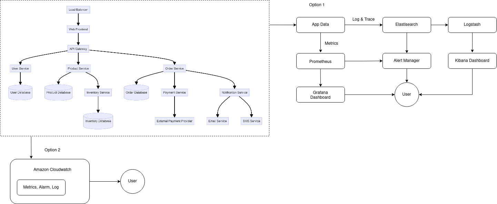

# observability-arch
## Gambar Arsitektur

Ini merupakan sedikit gambaran dari sistem arsitektur untuk observability jika kita memiliki client yang bisa dibilang awam untuk melihat keadaan aplikasinya.

Disini saya memberikan dua opsi untuk implementasi yaitu menggunakan beberapa library open source dan konfigurasi yang menyesuaikan kebutuhan, dan juga opsi implementasi langsung jika menggunakan AWS

### Option 1
Opsi pertama ini menggunakan prometheus-grafana untuk melihat status dari system, dan ELK stack untuk melihat keadaan dari aplikasi.

Prometheus disini akan mengambil data matrics terkait keadaan sistem seperti RAM, CPU, Disk usage yang akan ditampilkan melalui grafana dashboard, untuk dapat melihat performa dari *hardware* system secara lebih jelas. Akan diimplementasikan juga alert manager, ini mungkin lebih ke email, atau notifikasi lain kepada user ketika penggunaan resource sudah mendekati maximal, atau ketika resource down.

Lalu ada ELK stack yang mungkin akan cukup sering dilihat oleh user melalui kibana dashboardnya, untuk melihat traffic dari pengguna dan juga performa dari aplikasi itu sendiri, apakah ada banyak log error, atau log sukses, dan kapan waktu padat penggunaan aplikasi yang nantinya bisa untuk penyesuaian resource yang akan di deploy agar dapat mengimbangi permintaan client. Alert manager disini juga di set untuk beberapa error tingkat tinggi yang mungkin mempengaruhi kinerja sistem secara keseluruhan.

Jika diminta digambarkan untuk data yang dikelola oleh opsi pertama ini mungkin dari segi arsitektur adalah resource yang digunakan dari setiap service, baik itu memory, cpu, dan disk, serta data yang berhubungan dengan aktivitas aplikasi seperti pesan sukses, pesan error, ataupun hubungan antara aplikasi dengan penyedia payment gateway.

### Option 2
Opsi ini lebih ke pemantauan dan juga observasi terkait penggunaan resource AWS, serta hubungan antara service yang mungkin bisa dipantau dengan lebih baik. Opsi ini bisa diambil ketika developer tidak terlalu ingin untuk terlalu banyak mengkonfigurasi sistem observasi ini, karena hanya perlu memilih dan mengimplementasikan opsi yang telah diberikan oleh AWS. Opsi ini mungkin cocok untuk pemantauan resource dan alerting pada client jika ada beberapa instance yang tidak dapat digunakan atau mengalami gangguan.